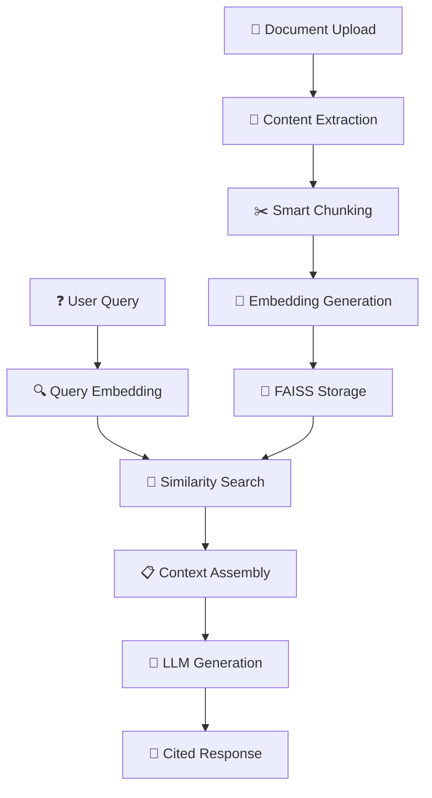

# 🤖 Intelligent RAG System

<div align="center">


**Production-Ready Retrieval-Augmented Generation System**

*AI-Powered Document Intelligence with Citation-Based Responses*

[🚀 Live Demo](#-quick-start) • [📖 Documentation](#-architecture) • [🛠️ Installation](#-installation) • [🔧 Usage](#-usage)

</div>

---

## 🌟 Overview

**Intelligent RAG System** is a production-ready Retrieval-Augmented Generation platform that combines the power of Large Language Models with precise document retrieval. Built by **[Shaikh Akbar Ali](https://github.com/SHAIKH-AKBAR-ALI)**, AI Engineer & Data Scientist, this system addresses LLM hallucination through grounded, citation-based responses.

### ✨ Key Features

🎯 **Dual Chat Modes**
- **Direct LLM Chat**: General AI assistance for any topic
- **RAG Chat**: Document-specific Q&A with source citations

📚 **Multi-Format Support**
- PDF, DOCX, TXT files
- Web URLs with intelligent content extraction
- Real-time document processing

🔍 **Advanced Retrieval**
- FAISS vector database for semantic search
- Smart chunking with sentence-aware segmentation
- Configurable overlap for context continuity

🛡️ **Enterprise Security**
- Per-user API key system (session-only storage)
- No server-side credential storage
- Privacy-first architecture

🎨 **Professional UI**
- Modern Streamlit interface
- Real-time processing feedback
- Export chat functionality
- Responsive design

---

## 🏗️ Architecture

### System Flow



### 🧩 Component Architecture

```
┌─────────────────────────────────────────────────────────────────┐
│                        STREAMLIT UI                             │
│  ┌─────────────────┐  ┌─────────────────┐  ┌─────────────────┐ │
│  │   API Keys      │  │   Documents     │  │     Status      │ │
│  │   Management    │  │   Ingestion     │  │    Monitor      │ │
│  └─────────────────┘  └─────────────────┘  └─────────────────┘ │
└─────────────────────────────────────────────────────────────────┘
                                │
                                ▼
┌─────────────────────────────────────────────────────────────────┐
│                     INGESTION PIPELINE                         │
│  PDF/DOCX/TXT ──► Content Extraction ──► Smart Chunking       │
│  URLs ──────────► Web Scraping ──────────► Text Processing     │
└─────────────────────────────────────────────────────────────────┘
                                │
                                ▼
┌─────────────────────────────────────────────────────────────────┐
│                    EMBEDDING & STORAGE                         │
│  Chunks ──► OpenAI Embeddings ──► FAISS Vector DB             │
└─────────────────────────────────────────────────────────────────┘
                                │
                                ▼
┌─────────────────────────────────────────────────────────────────┐
│                      RAG PIPELINE                              │
│  Query ──► Embedding ──► Retrieval ──► Context ──► Response    │
└─────────────────────────────────────────────────────────────────┘
```

---

## 🚀 Quick Start

### Prerequisites

- Python 3.8+
- OpenAI API Key ([Get one here](https://platform.openai.com/api-keys))

### ⚡ One-Click Setup

```bash
# Clone the repository
git clone https://github.com/SHAIKH-AKBAR-ALI/intelligent-rag-system.git
cd intelligent-rag-system

# Install dependencies
pip install -r requirements.txt

# Run the application
streamlit run src/ui/streamlit_app.py
```

### 🔧 Configuration

1. **API Keys**: Enter your OpenAI API key directly in the UI (secure, session-only storage)
2. **Upload Documents**: Add PDFs, DOCX, TXT files, or paste URLs
3. **Start Chatting**: Choose between Direct LLM or RAG mode

---

## 💻 Installation

### Local Development

```bash
# 1. Clone and navigate
git clone https://github.com/SHAIKH-AKBAR-ALI/intelligent-rag-system.git
cd intelligent-rag-system

# 2. Create virtual environment (recommended)
python -m venv venv
source venv/bin/activate  # On Windows: venv\Scripts\activate

# 3. Install dependencies
pip install -r requirements.txt

# 4. Optional: Set up local environment
cp .env.example .env
# Edit .env with your API keys (for development only)

# 5. Run the application
streamlit run src/ui/streamlit_app.py
```

### 🐳 Docker Deployment

```dockerfile
# Dockerfile included for containerized deployment
docker build -t intelligent-rag-system .
docker run -p 8501:8501 intelligent-rag-system
```

### ☁️ Cloud Deployment

**Streamlit Cloud** (Recommended)
1. Fork this repository
2. Connect to [Streamlit Cloud](https://streamlit.io/cloud)
3. Deploy directly - no server configuration needed!

---

## 🔧 Usage

### 🎯 Chat Modes

#### Direct LLM Chat
```
Perfect for:
✅ General questions and creative tasks
✅ Coding assistance and explanations  
✅ Brainstorming and ideation
✅ Any topic not requiring specific documents
```

#### RAG Chat (Documents)
```
Perfect for:
✅ Document-specific questions
✅ Research and analysis
✅ Fact-checking with citations
✅ Content summarization
```

### 📚 Supported Formats

| Format | Description | Use Case |
|--------|-------------|----------|
| **PDF** | Portable Document Format | Research papers, reports, manuals |
| **DOCX** | Microsoft Word Documents | Articles, documentation, letters |
| **TXT** | Plain Text Files | Code, notes, simple documents |
| **URLs** | Web Pages | Articles, blogs, online content |

### 🔍 Advanced Features

- **Smart Chunking**: Sentence-aware segmentation (1000 chars, 200 overlap)
- **Citation System**: Numbered source references in responses
- **Export Functionality**: Download chat history
- **Real-time Processing**: Live feedback during document ingestion
- **Session Management**: Separate histories for each chat mode

---

## 🛠️ Technical Details

### 🧠 Core Technologies

| Component | Technology | Purpose |
|-----------|------------|---------|
| **LLM** | OpenAI GPT-4o-mini | Text generation and reasoning |
| **Embeddings** | text-embedding-3-small | Semantic vector representation |
| **Vector DB** | FAISS | Efficient similarity search |
| **Frontend** | Streamlit | Interactive web interface |
| **Backend** | Python | Core processing logic |

### 📊 Performance Metrics

- **Embedding Dimension**: 1536 (OpenAI text-embedding-3-small)
- **Chunk Size**: 1000 characters with 200-character overlap
- **Retrieval**: Top-4 most relevant chunks
- **Response Time**: ~2-5 seconds (depending on document size)

### 🔒 Security Features

- **Session-Only Storage**: API keys never persisted
- **No Server Secrets**: Users provide their own credentials
- **Privacy First**: No data logging or external storage
- **Secure Processing**: All operations in user session

---

## 📁 Project Structure

```
intelligent-rag-system/
├── 📁 src/
│   ├── 🧠 agents/           # RAG orchestration
│   ├── ⚙️ core/             # Configuration management
│   ├── 📥 ingestion/        # Document processing
│   ├── 🤖 llm_providers/    # LLM & embedding adapters
│   ├── 💬 prompts/          # Prompt templates
│   ├── 📝 text/             # Text processing utilities
│   ├── 🎨 ui/               # Streamlit interface
│   └── 💾 vectorstore/      # FAISS vector operations
├── 📋 requirements.txt      # Python dependencies
├── 🔒 .env.example         # Environment template
├── 🛡️ SECURITY.md          # Security guidelines
└── 📖 README.md            # This file
```

---

## 🎯 Use Cases

### 📚 Academic Research
- Upload research papers and ask specific questions
- Get cited responses with source attribution
- Compare findings across multiple documents

### 💼 Business Intelligence
- Analyze reports and extract key insights
- Query company documents and policies
- Generate summaries with source references

### 📖 Content Analysis
- Process articles, blogs, and web content
- Extract specific information with citations
- Compare content across multiple sources

### 🔍 Technical Documentation
- Query API documentation and manuals
- Get specific implementation details
- Find relevant code examples and explanations

---

## 🚀 Roadmap

### 🔄 Current Version (v1.0)
- ✅ Basic RAG functionality
- ✅ Multi-format document support
- ✅ Dual chat modes
- ✅ Citation system
- ✅ Session-based security

### 🎯 Upcoming Features (v2.0)
- 🔄 Multi-language support
- 🔄 Advanced chunking strategies
- 🔄 Conversation memory
- 🔄 Batch document processing
- 🔄 API endpoint for integration

### 🌟 Future Enhancements (v3.0)
- 🔄 Multi-modal support (images, tables)
- 🔄 Collaborative workspaces
- 🔄 Advanced analytics dashboard
- 🔄 Enterprise SSO integration
- 🔄 Custom model fine-tuning

---

## 🤝 Contributing

We welcome contributions! Here's how you can help:

### 🐛 Bug Reports
1. Check existing issues first
2. Provide detailed reproduction steps
3. Include system information and logs

### ✨ Feature Requests
1. Describe the use case clearly
2. Explain the expected behavior
3. Consider implementation complexity

### 🔧 Code Contributions
1. Fork the repository
2. Create a feature branch
3. Follow the coding standards
4. Add tests for new functionality
5. Submit a pull request

### 📝 Development Setup
```bash
# Install development dependencies
pip install -r requirements-dev.txt

# Run tests
python -m pytest tests/

# Format code
black src/
isort src/

# Lint code
flake8 src/
```

---

## 📄 License

This project is licensed under the **MIT License** - see the [LICENSE](LICENSE) file for details.

```
MIT License - Feel free to use, modify, and distribute
Commercial use permitted with attribution
```

---

## 👨‍💻 About the Developer

<div align="center">

### **SHAIKH AKBAR ALI**
*AI Engineer & Data Scientist*

[](https://linkedin.com/in/shaikh-akbar-ali)
[](https://github.com/SHAIKH-AKBAR-ALI)
[](mailto:your.email@example.com)

**Specializing in:**
- 🧠 Large Language Model Applications
- 🔍 RAG Systems & Vector Databases  
- ⚡ Production ML Pipelines
- 🚀 AI Product Development

</div>

---

## 🙏 Acknowledgments

- **OpenAI** for providing excellent LLM and embedding APIs
- **Facebook Research** for the FAISS vector database
- **Streamlit** for the amazing web framework
- **Python Community** for the incredible ecosystem

---

## 📞 Support

Need help? Here are your options:

- 📖 **Documentation**: Check this README and code comments
- 🐛 **Issues**: [Create a GitHub issue](https://github.com/SHAIKH-AKBAR-ALI/intelligent-rag-system/issues)
- 💬 **Discussions**: [Join the discussion](https://github.com/SHAIKH-AKBAR-ALI/intelligent-rag-system/discussions)
- 📧 **Direct Contact**: Reach out for enterprise support

---

<div align="center">

**⭐ If you find this project helpful, please give it a star! ⭐**

*Built with ❤️ by [Shaikh Akbar Ali](https://github.com/SHAIKH-AKBAR-ALI)*

</div>